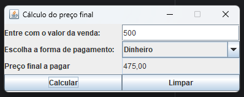

# Calculadora de Preço Final

Este projeto é uma aplicação Java desenvolvida usando Swing para simular o cálculo do valor final de uma venda, baseado na forma de pagamento escolhida pelo usuário.

## Sobre o Projeto

A aplicação permite que o usuário:

- Informe o valor da venda.

- Escolha a forma de pagamento (Dinheiro, Cheque ou Cartão).

- Visualize o preço final ajustado conforme o método de pagamento.

### Regras de Cálculo:

- Dinheiro: desconto de 5% no valor da venda.

- Cheque: acréscimo de 5% no valor da venda.

- Cartão: acréscimo de 10% no valor da venda.

### Como o Código Funciona

## Estrutura Principal

- A classe CalculadoraPrecoFinal herda de JFrame, criando a janela principal.

- A interface gráfica é construída usando o layout GridLayout, organizando os campos e botões de forma simples.

## Componentes Utilizados:

- JLabel para exibir os textos.

- JTextField para entrada do valor e exibição do preço final.

- JComboBox para seleção da forma de pagamento.

- JButton para os botões Calcular e Limpar.

## Lógica dos Botões:

- Calcular:

    - Lê o valor digitado.

    - Verifica a forma de pagamento selecionada.

    - Calcula o preço final de acordo com as regras.

    - Exibe o resultado no campo "Preço final a pagar".

- Limpar:

    - Limpa todos os campos da tela, permitindo uma nova operação.

Tratamento de Erros:

- Se o usuário digitar um valor inválido, será exibida uma mensagem de erro através de JOptionPane.

### Interface da Aplicação 📸

- A interface é semelhante a essa:

